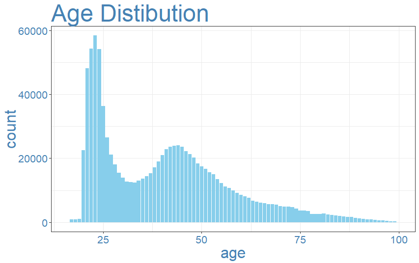
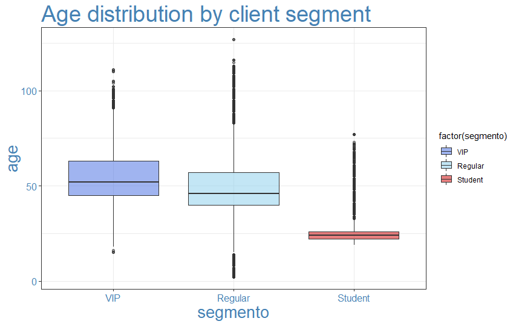
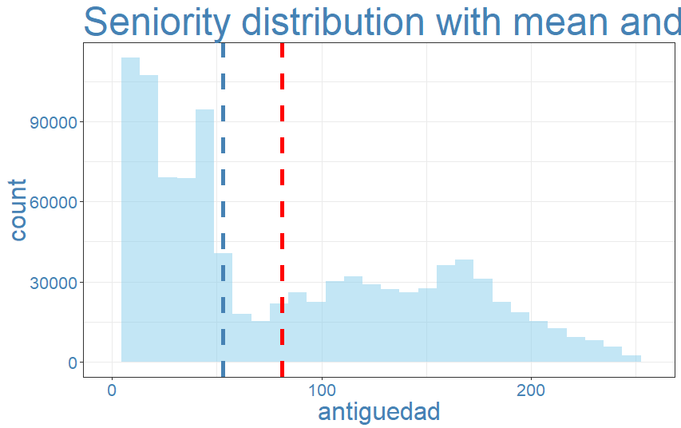
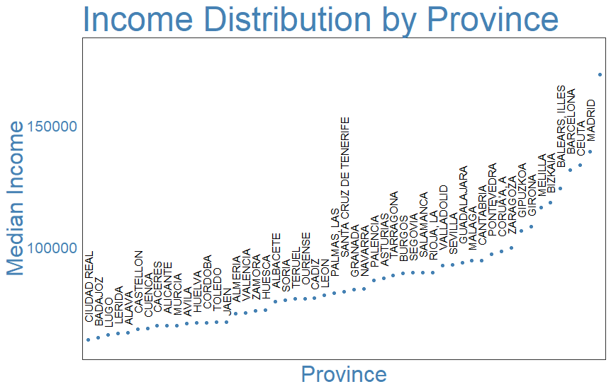

Santander Product Recommendation
================


The goal of this project is to take Santander Bank customer information between January 2015 and May 2016, and to design a solution to predict which financial service products they would purchase in the next month :rocket: . 

---------------------------------------

### Bring in the data

The dataset contains 48 variables and around 13.6 million rows of data observations. I find this dataset too large for my PC to process, and therefore decide to take a random sample of 1 million rows and use it for all further exercises. Given that financial service industry is subject to seasonal trend (Christmas bonus, tax season, etc.) and the goal is to predict the purchasing behaviour for June, I decide to take 80% of the data from May - Jun 2015 and May 2016, and 20% from the rest months.

1. Categorical variables:

| Variable               	|  Defination                                             	|
|------------------------	|---------------------------------------------------------	|
| sexo                   	|  gender                                                 	|
| ind_nuevo              	|  new customer index                                     	|
| ind_empleado           	|  customer employee status                               	|
| segmento               	|  segmentation                                           	|
| nomprov                	|  Province                                               	|
| tipodom                	|  Address                                                	|
| cod_prov               	|  Province code                                          	|
| indext                 	|  Foreigner index                                        	|
| indresi                	|  Residence index                                        	|
| indrel                 	|  primary customer at beginning but   not end of month   	|
| tiprel_1mes            	|  Customer relation type at the   beginning of the month 	|
| ind_actividad_cliente  	|  customer active index                                  	|
| canal_entrada          	|  Acquisition channel                                    	|
| conyuemp               	|  Spourse index                                          	|

2. Numeric variables:

| Variables                                                                   	|  Defination          	|
|-----------------------------------------------------------------------------	|----------------------	|
| age                                                                         	|  age                 	|
| antiguedad                                                                  	|  seniority in months 	|
| renta                                                                       	|  gross income        	|

3. Target Variables: 

| Variable           	|  Defination              	|
|--------------------	|--------------------------	|
| ind_ahor_fin_ult1  	|  Saving Account          	|
| ind_aval_fin_ult1  	|  Guarantees              	|
| ind_cco_fin_ult1   	|  Current Accounts        	|
| ind_cder_fin_ult1  	|  Derivada Account        	|
| ind_cno_fin_ult1   	|  Payroll Account         	|
| ind_ctju_fin_ult1  	|  Junior Account          	|
| ind_ctma_fin_ult1  	|  Más particular Account  	|
| ind_ctop_fin_ult1  	|  particular Account      	|
| ind_ctpp_fin_ult1  	|  particular Plus Account 	|
| ind_deco_fin_ult1  	|  Short - term deposits   	|
| ind_deme_fin_ult1  	|  Medium - term deposits  	|
| ind_dela_fin_ult1  	|  Long - term deposits    	|
| ind_ecue_fin_ult1  	|  e - account             	|
| ind_fond_fin_ult1  	|  Funds                   	|
| ind_hip_fin_ult1   	|  Mortgage                	|
| ind_plan_fin_ult1  	|  Pensions                	|
| ind_pres_fin_ult1  	|  Loans                   	|
| ind_reca_fin_ult1  	|  Taxes                   	|
| ind_tjcr_fin_ult1  	|  Credit Card             	|
| ind_valo_fin_ult1  	|  Securities              	|
| ind_viv_fin_ult1   	|  Home Account            	|
| ind_nomina_ult1    	|  Payroll                 	|
| ind_nom_pens_ult1  	|  Pensions                	|
| ind_recibo_ult1    	|  Direct Debit            	|

### Prepare R
``` r
library(dplyr)
library(tidyr)
library(Amelia)
library(ggplot2)
library(lubridate)

set.seed(1)
my_theme <- theme_bw() +
  theme(axis.title=element_text(size=24,color="steelblue"),
        plot.title=element_text(size=36,color="steelblue"),
        axis.text =element_text(size=16,color="steelblue") )

my_theme_dark <- theme_dark() +
  theme(axis.title=element_text(size=24),
        plot.title=element_text(size=36),
        axis.text =element_text(size=16))
```
### First Glance
``` r
dta <- read.csv('Santander_Train2.csv', fileEncoding="UTF-8-BOM")
str(dta)
colSums(is.na(dta))
```
`Renta` (gross income) has most number of missing values, 204,118 in total, followed by `cod_prov` with 7,474 missing values. `Age`, `fecha_alta`, `Ind_nuevo`, `indrel`, `antiguedad`, `tipodom` and `ind_actividad_cliente` all have 2,407 missing values, so I want to further explore if it’s the same group of customer. `ind_nomina_ult1` and `ind_nom_pens_ult1` are two product variables that have 1,902 missing values.

The next step is to decide how I can fill in the missing values or if I should just drop them.

### Missing Value Imputation

I want to start with checking the distribution of `age`.

Looks like the distribution is very right skewed - Santander has an abundance of student aged clients, and a great number of clients in their 40's and 50's. 


It can be clearly seen the median age varies among different segments. Rather than just imputing missing age values by the overall average age, I decide to use median age for each segment instead.
```r
new.age <- dta %>%
select(segmento) %>%
merge(dta %>%
group_by(segmento) %>%
dplyr::summarise(med.age=median(age,na.rm=TRUE)),by="segmento") %>%
select(segmento,med.age) %>%
arrange(segmento)
dta <- arrange(dta,segmento)
dta$age[is.na(dta$age)] <- new.age$med.age[is.na(dta$age)]
```
`antiguedad` contains customer senoirty in months.Weirdly, there is a large amount of negative values in the dataset. When I look at the distibution of only positive values, it's right skewed. Most client has a client-joined-date so I decide to recalulate the seniority for each client, using `fecha_alta`.


```r
summary(dta$antiguedad)
dta$fecha_alta[is.na(dta$fecha_alta)] <- median(dta$fecha_alta,na.rm=TRUE)
elapsed.months <- function(end_date, start_date) {
  12 * (year(end_date) - year(start_date)) + (month(end_date) - month(start_date))
}
recalculated.antiguedad <- elapsed.months(dta$fecha_dato,dta$fecha_alta)
dta$antiguedad <- recalculated.antiguedad
```


Moving on to `ind_nuevo`, which indicates if  the client is new or not. When I look at how many month seniority these clients have, they all have over 3 year's seniority. Looks like they are all 0 - old clients
``` r
ant <- dta%>% 
filter (is.na(ind_nuevo)) %>%
select(antiguedad)
summary(ant)
dta$ind_nuevo[is.na(dta$ind_nuevo)] <- 0
```


`Renta` is a variable with a lot of missing values. By checking its range, I realise there is a significant rich-poor gap among Santander customers.

Look at the distribution of `renta` by province: 



Again, instead of filling in missing values with mean or median, I think it’s more accurate to break it down by province and use the median of each province.
```r
new.incomes <- dta %>%
select(nomprov) %>%
merge(dta %>%
group_by(nomprov) %>%
dplyr::summarise(med.income=median(renta,na.rm=TRUE)),by="nomprov") %>%
select(nomprov,med.income) %>%
arrange(nomprov)
dta <- arrange(dta,nomprov)
dta$renta[is.na(dta$renta)] <- new.incomes$med.income[is.na(dta$renta)]
dta$renta[is.na(dta$renta)] <- median(dta$renta,na.rm=TRUE)
```


`Indrel` indicates whether clients are still primary customers (1), or no longer primary customers at end of month (99). It seems to be an interesting variable, as customers who are no longer primary at end of month are likely to have different purchasing behaviours than the others. Choose to replace the missing values with the more frequent status, which is "1" in this case.
```r
table(dta$indrel)
dta$indrel[is.na(dta$indrel)] <- 1 
```

`Ind_actividad_cliente`, which indicates if clients are active or not. Again, I choose to replace the missing values with the more frequent status.
 
I decide to drop variable cod_prov, since province information is already saved in nomprov. 

Address type variable `tipodom` has a few missing values too. After checking data distibution, all observatons have a address type of "1" - primary address. Choose to drop the variable.
 
Lastly, for the two product variables, replace the missing values with the more frequent status, which is 0.
```r
table(dta$ind_nomina_ult1)
dta$ind_nomina_ult1[is.na(dta$ind_nomina_ult1)] <- median(dta$ind_nomina_ult1,na.rm=TRUE)
table(dta$ind_nom_pens_ult1)
dta$ind_nom_pens_ult1[is.na(dta$ind_nom_pens_ult1)] <- median(dta$ind_nom_pens_ult1,na.rm=TRUE)
```


### Empty Value Imputation

After examining the data, I find out there’s also abundance of character variables that contain empty values and inconsistent formats.I decide to correct the formats, and either fill the empty strings with the most common value or remove the variable, based on my judgement.
Now I am finished cleaning all the data. The cleaned dataset will be uploaded to github page.
```r
dta$indfall[dta$indfall==""]                 <- "N"
dta$tiprel_1mes[dta$tiprel_1mes==""]         <- "I"
dta$indrel_1mes[dta$indrel_1mes==""]         <- "1"
dta$indrel_1mes[dta$indrel_1mes=="1.0"]        <- "1"
dta$indrel_1mes[dta$indrel_1mes=="2.0"]        <- "2"
dta$indrel_1mes[dta$indrel_1mes=="3.0"]        <- "3"
dta$indrel_1mes[dta$indrel_1mes=="4.0"]        <- "4"

dta$pais_residencia[dta$pais_residencia==""] <- "ES"
dta$sexo[dta$sexo==""]                       <- "V"
dta <- dta %>% select (-ult_fec_cli_1t)
dta$ind_empleado[dta$ind_empleado==""]       <- "N"
dta$indext[dta$indext==""]                   <- "N"
dta$indresi[dta$indresi==""]                 <- "S"
dta <- dta %>% select (-conyuemp)
dta$segmento[dta$segmento==""]               <- "02 - PARTICULARES"

str(dta)


write.csv(dta, "Santander_cleaned.csv",row.names = FALSE)
```
