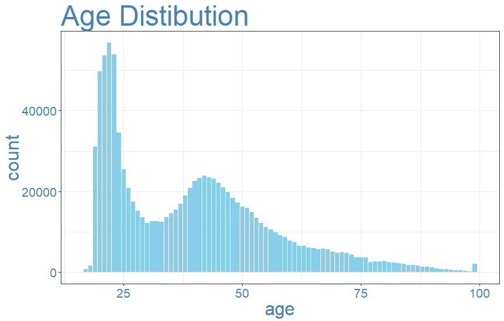

## Santander Product Recommendation

The goal of this project is to take Santander Bank customer information between January 2015 and May 2016, and to design a solution to predict which financial service products they would purchase in the next month :rocket: . 

### Data Wrangling
---------------------------------------

#### Bring in the data

The dataset contains 48 variables and around 13.6 million rows of data observations. I find this dataset too large for my PC to process, and therefore decide to take a random sample of 1 million rows and use it for all further exercises.

1. Categorical variables:

| Variable               	|  Defination                                             	|
|------------------------	|---------------------------------------------------------	|
| sexo                   	|  gender                                                 	|
| ind_nuevo              	|  new customer index                                     	|
| ind_empleado           	|  customer employee status                               	|
| segmento               	|  segmentation                                           	|
| nomprov                	|  Province                                               	|
| tipodom                	|  Address                                                	|
| cod_prov               	|  Province code                                          	|
| indext                 	|  Foreigner index                                        	|
| indresi                	|  Residence index                                        	|
| indrel                 	|  primary customer at beginning but   not end of month   	|
| tiprel_1mes            	|  Customer relation type at the   beginning of the month 	|
| ind_actividad_cliente  	|  customer active index                                  	|
| canal_entrada          	|  Acquisition channel                                    	|
| conyuemp               	|  Spourse index                                          	|

2. Numeric variables:

| Variables                                                                   	|  Defination          	|
|-----------------------------------------------------------------------------	|----------------------	|
| age                                                                         	|  age                 	|
| antiguedad – This was a categorical variable   that I changed into numeric  	|  seniority in months 	|
| renta                                                                       	|  gross income        	|

3. Target Variables: 

| Variable           	|  Defination              	|
|--------------------	|--------------------------	|
| ind_ahor_fin_ult1  	|  Saving Account          	|
| ind_aval_fin_ult1  	|  Guarantees              	|
| ind_cco_fin_ult1   	|  Current Accounts        	|
| ind_cder_fin_ult1  	|  Derivada Account        	|
| ind_cno_fin_ult1   	|  Payroll Account         	|
| ind_ctju_fin_ult1  	|  Junior Account          	|
| ind_ctma_fin_ult1  	|  Más particular Account  	|
| ind_ctop_fin_ult1  	|  particular Account      	|
| ind_ctpp_fin_ult1  	|  particular Plus Account 	|
| ind_deco_fin_ult1  	|  Short - term deposits   	|
| ind_deme_fin_ult1  	|  Medium - term deposits  	|
| ind_dela_fin_ult1  	|  Long - term deposits    	|
| ind_ecue_fin_ult1  	|  e - account             	|
| ind_fond_fin_ult1  	|  Funds                   	|
| ind_hip_fin_ult1   	|  Mortgage                	|
| ind_plan_fin_ult1  	|  Pensions                	|
| ind_pres_fin_ult1  	|  Loans                   	|
| ind_reca_fin_ult1  	|  Taxes                   	|
| ind_tjcr_fin_ult1  	|  Credit Card             	|
| ind_valo_fin_ult1  	|  Securities              	|
| ind_viv_fin_ult1   	|  Home Account            	|
| ind_nomina_ult1    	|  Payroll                 	|
| ind_nom_pens_ult1  	|  Pensions                	|
| ind_recibo_ult1    	|  Direct Debit            	|

#### Prepare R
``` r
library(dplyr)
library(tidyr)
library(Amelia)
library(ggplot2)

set.seed(1)
my_theme <- theme_bw() +
  theme(axis.title=element_text(size=24,color="steelblue"),
        plot.title=element_text(size=36,color="steelblue"),
        axis.text =element_text(size=16,color="steelblue") )

my_theme_dark <- theme_dark() +
  theme(axis.title=element_text(size=24),
        plot.title=element_text(size=36),
        axis.text =element_text(size=16))
```
#### First Glance
``` r
dta <- read.csv('santander_train.csv')
str(dta)
colSums(is.na(dta))
```
`Renta` (gross income) has most number of missing values, 205,158 in total, followed by `cod_prov` with 6,898 missing values. `Ind_nuevo`, `indrel`, `tipodom` and `ind_actividad_cliente` all have 2,040 missing values, so I want to further explore if it’s the same group of customer. `ind_nomina_ult1` and `ind_nom_pens_ult1` are two product variables that have 1,152 missing values.

The next step is to decide how I can fill in the missing values or if I should just drop them.

#### Missing Value Imputation

I want to start with `ind_nuevo`, which indicates if  the client is new or not. When I look at how many month of history these clients have in the dataset, they all have 4 months history. Looks like they are all new clients.
``` r
months.active <- dta[is.na(dta$ind_nuevo),] %>%
group_by(ncodpers) %>%
summarise(months.active=n())  %>%
select(months.active)
max(months.active)

dta$ind_nuevo[is.na(dta$ind_nuevo)] <- 1
```


`Renta` is a variable with a lot of missing values. By checking its range, I realise there is a significant rich-poor gap among Santander customers.
```r
summary(dta$renta)
```
Look at the distribution of `renta` by province: 
```r
dta %>%
  filter(!is.na(renta)) %>%
  group_by(nomprov) %>%
  summarise(med.income = median(renta)) %>%
  arrange(med.income) %>%
  mutate(prov=factor(nomprov,levels=nomprov)) %>%
  ggplot(aes(x=prov,y=med.income)) +
  geom_point(color="steelblue") +
  guides(color=FALSE) +
  xlab("Province") +
  ylab("Median Income") +
  my_theme +
  theme(axis.text.x=element_blank(), axis.ticks = element_blank()) +
  geom_text(aes(x=prov,y=med.income,label=prov),angle=90,hjust=-.25)+
  theme(
        panel.grid =element_blank(),
        axis.title =element_text(color="steelblue"),
        axis.text  =element_text(color="steelblue"),
        plot.title =element_text(color="steelblue")) +
  ylim(c(60000,180000)) +
  ggtitle("Income Distribution by Province")
```


Instead of filling in missing values with mean or median, I think it’s more accurate to break it down by province and use the median of each province.
```r
new.incomes <- dta %>%
select(nomprov) %>%
merge(dta %>%
group_by(nomprov) %>%
dplyr::summarise(med.income=median(renta,na.rm=TRUE)),by="nomprov") %>%
select(nomprov,med.income) %>%
arrange(nomprov)
dta <- arrange(dta,nomprov)
dta$renta[is.na(dta$renta)] <- new.incomes$med.income[is.na(dta$renta)]
dta$renta[is.na(dta$renta)] <- median(dta$renta,na.rm=TRUE)
```


`Indrel` indicates whether clients are still primary customers (1), or no longer primary customers at end of month (99). It seems to be an interesting variable, as customers who are no longer primary at end of month are likely to have different purchasing behaviours than the others. Choose to replace the missing values with the more frequent status, which is "1" in this case.
```r
table(dta$indrel)
dta$indrel[is.na(dta$indrel)] <- 1 
```

`Ind_actividad_cliente`, which indicates if clients are active or not. Choose to replace the missing values with the more frequent status.
```r
table(dta$ind_actividad_cliente)
dta$ind_actividad_cliente[is.na(dta$ind_actividad_cliente)] <- median(dta$ind_actividad_cliente,na.rm=TRUE)
```
 
I decide to drop variable cod_prov, since province information is already saved in nomprov. 
```r
dta <- dta %>% select (-X, -cod_prov)
```

Address type variable `tipodom` has a few missing values too. After checking data distibution, all observatons have a address type of "1" - primary address. Choose to drop the variable.
```r
table(dta$tipodom)
dta <- dta %>% select (-tipodom)
```
 
Lastly, for the two product variables, replace the missing values with the more frequent status, which is 0.
```r
table(dta$ind_nomina_ult1)
dta$ind_nomina_ult1[is.na(dta$ind_nomina_ult1)] <- median(dta$ind_nomina_ult1,na.rm=TRUE)
table(dta$ind_nom_pens_ult1)
dta$ind_nom_pens_ult1[is.na(dta$ind_nom_pens_ult1)] <- median(dta$ind_nom_pens_ult1,na.rm=TRUE)
```
Now I am finished handling missing values.

#### Empty Value Imputation
```r
colSums(dta=="")
```


### Exploratory Data Analysis
---------------------------------------
#### Convert Data Type

Convert age and seniority from factors to integers.
```r
dta$antiguedad=as.integer(dta$antiguedad)
dta$age=as.integer(dta$age)
```

#### EDA on Age and Product Ownership
Take a look at client age distibution: 
```r
ggplot(dta,aes(x=age))+
geom_bar(aes(y = ..count..),position="dodge", fill="skyblue")+
xlim(c(16,100))+
my_theme+
ggtitle("Age Distibution")
```



```markdown
Syntax highlighted code block

# Header 1
## Header 2
### Header 3


