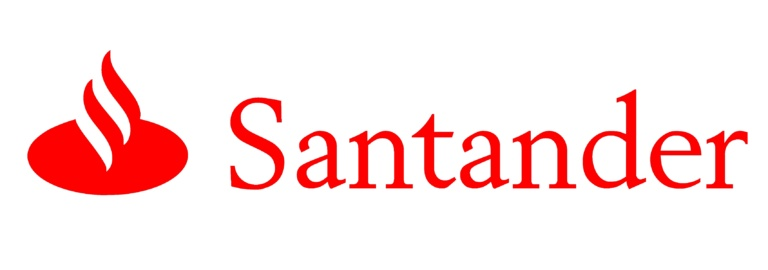

# Santander Product Recommendation

Audrey Meng
2019 Sept. 22

### Part 1 - Project Goals

To support needs for a range of financial decisions, Santander Bank offers a lending hand to their customers through personalized product recommendations. Under their current system, a small number of Santander’s customers receive many recommendations while many others rarely see any, resulting in poor customer experience.

The project aims to assist the bank to predict which products their existing customers will use in the next month based on their past behaviors and product ownerships. The goal of this project is to take Santander Bank customer information between January 2015 and May 2016, understand client behaviours and to design a solution to predict which financial service products they are likely to purchase in the next month. With a more effective recommendation system in place, Santander can better meet their client’s needs, provide better client experience with more personalised product recommendations.

Data used in this project is available on [Kaggle](https://www.kaggle.com/c/santander-product-recommendation/data). This project mainly uses train dataset, which includes 13 millions rows of customer bahaviour data, split by month.

### Part 2 - Recommendations

### Part 3 - Detailed Data Analysis

#### Data Wrangling

#### Exploratory Data Analysis

#### Model

#### Model Results

### Part 4 - Limitations and Further Study

Due to resource constaints, the analysis conducted in this project is based on a stratified random sampled dataset. In other words, the data is incomplete. While it is very reasonable to assume seasonality in financial service industry and pay closer attention to May and June data, taking a random sample still loses a substantial part of the data and limits its usability.

One of the biggest limitations of using sampled data is I am not able to track client over time. For example, `Indrel` indicates whether clients are still primary customers (1), or no longer primary customers at end of month (99). It seems to be an important variable, as customers who are no longer primary at end of month are likely to have had different purchasing behaviours than the others. For clients who are no longer primary customers at end of month, it would be interesting to compare their product owenership with previous month. Other questions that can be answered with full dataset include:

* Which products are usually bought together or within short period of time?
* What is the most common order of purchase? For example, chequing account, saving account then mortgage?
* It costs much less to maintain and cross sell to an existing client than to acquire a new one. How long does it take to cross sell or upsell other products to clients in differnt segments? In other words, how much marketing and sales efforts should Santander expect to spend, before they become multi-line (and more profitable) clients?

