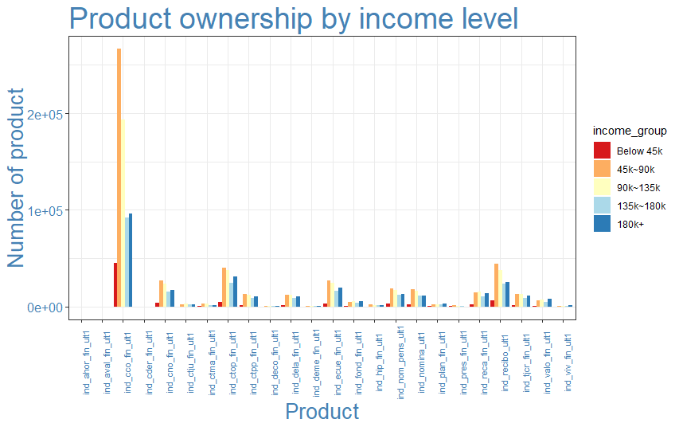

# Santander Product Recommendation

Audrey Meng
Sept. 22 2019


### Part 1 - Project Goals

To support needs for a range of financial decisions, Santander Bank offers a lending hand to their customers through personalized product recommendations. Under their current system, a small number of Santander’s customers receive many recommendations while many others rarely see any, resulting in poor customer experience.

The project aims to assist the bank to predict which products their existing customers will use in the next month based on their past behaviors and product ownerships. The goal of this project is to take Santander Bank customer information between January 2015 and May 2016, understand client behaviours and to design a solution to predict which financial service products they are likely to purchase in the next month. With a more effective recommendation system in place, Santander can better meet their client’s needs, provide better client experience with more personalised product recommendations.

Data used in this project is available on [Kaggle](https://www.kaggle.com/c/santander-product-recommendation/data). This project mainly uses train dataset, which includes 13 millions rows of customer bahaviour data, split by month.


### Part 2 - Recommendations

* we

* Santander has abun tudent clients

* VIP clients

* Affluent clients 

* Depends on the corporate strategy and goal of marketing and sales campaign, Santander should target clients from different acquisition channels. For a nurturing campaign, Santander should speicifically target clients from "KHE" and "KHQ", as most of them only have Current account and probably do not have enough knowledge about Santander's product offering. From a recommendation perspective, clients from "KAT" are more likely to open Particular account.

* Clients with over 10 years of tenure are more likely to open Particular Account, Mid-term deposit and Tax account.

* Employee clients


### Part 3 - Data First Glance


#### 3.1 First Glance

The dataset contains 48 variables and around 13.6 million rows of data observations. I find this dataset too large for my PC to process, and therefore decide to take a random sample of 1 million rows and use it for all further exercises. Given that financial service industry is subject to seasonal trend (Christmas bonus, tax season, etc.) and the goal is to predict the purchasing behaviour for June, I decide to take 80% of the data from May - Jun 2015 and May 2016, and 20% from the rest months.
```r
dta %>% summarise(count = n_distinct(ncodpers))
#   count
#   644819
```
The dataset used has over 600k unique clients, which means most clients appear once or twice in this data.


* _Categorical variables:_

| Variable               	|  Defination                                             	|
|------------------------	|---------------------------------------------------------	|
| sexo                   	|  gender                                                 	|
| ind_nuevo              	|  new customer index                                     	|
| ind_empleado           	|  customer employee status                               	|
| segmento               	|  segmentation                                           	|
| nomprov                	|  Province                                               	|
| tipodom                	|  Address                                                	|
| cod_prov               	|  Province code                                          	|
| indext                 	|  Foreigner index                                        	|
| indresi                	|  Residence index                                        	|
| indrel                 	|  primary customer at beginning but   not end of month   	|
| tiprel_1mes            	|  Customer relation type at the   beginning of the month 	|
| ind_actividad_cliente  	|  customer active index                                  	|
| canal_entrada          	|  Acquisition channel                                    	|
| conyuemp               	|  Spourse index                                          	|
| fecha_dato             	|  The table is partitioned for this column                	|
| fecha_alta             	|  when they became first holder of a contract in the bank 	|


* _Numeric variables:_

| Variables                                                                   	|  Defination          	|
|-----------------------------------------------------------------------------	|----------------------	|
| age                                                                         	|  age                 	|
| antiguedad                                                                  	|  seniority in months 	|
| renta                                                                       	|  gross income        	|

* _Target Variables:_

| Variable           	|  Defination              	|
|--------------------	|--------------------------	|
| ind_ahor_fin_ult1  	|  Saving Account          	|
| ind_aval_fin_ult1  	|  Guarantees              	|
| ind_cco_fin_ult1   	|  Current Accounts        	|
| ind_cder_fin_ult1  	|  Derivada Account        	|
| ind_cno_fin_ult1   	|  Payroll Account         	|
| ind_ctju_fin_ult1  	|  Junior Account          	|
| ind_ctma_fin_ult1  	|  Más particular Account  	|
| ind_ctop_fin_ult1  	|  particular Account      	|
| ind_ctpp_fin_ult1  	|  particular Plus Account 	|
| ind_deco_fin_ult1  	|  Short - term deposits   	|
| ind_deme_fin_ult1  	|  Medium - term deposits  	|
| ind_dela_fin_ult1  	|  Long - term deposits    	|
| ind_ecue_fin_ult1  	|  e - account             	|
| ind_fond_fin_ult1  	|  Funds                   	|
| ind_hip_fin_ult1   	|  Mortgage                	|
| ind_plan_fin_ult1  	|  Pensions                	|
| ind_pres_fin_ult1  	|  Loans                   	|
| ind_reca_fin_ult1  	|  Taxes                   	|
| ind_tjcr_fin_ult1  	|  Credit Card             	|
| ind_valo_fin_ult1  	|  Securities              	|
| ind_viv_fin_ult1   	|  Home Account            	|
| ind_nomina_ult1    	|  Payroll                 	|
| ind_nom_pens_ult1  	|  Pensions                	|
| ind_recibo_ult1    	|  Direct Debit            	|

#### 3.2 Data Wrangling

Multiple data cleaning steps have to be conducted to the original dataset before I can perfrom any analysis and extract any valuable insights from it. 

Several variables contain missing values. Some of them can be simply imputed with more frequent status or median value, while others are more complicated. For example, I find out `renta` (gross income) has abundance of missing values and varies greatly across different province, therefore instead of filling in missing values with mean or median, it’s more accurate to break it down by province and use the median of each province.


`antiguedad` contains customer senoirty in months. I suspect data in this feature is not so accurate since there is a number of negative outliers in the dataset. Most client has a client joined date so I am able to recalulate the seniority for each client, using `fecha_alta` and `fecha_dato`.
```r
#   Min.   1st Qu.    Median      Mean   3rd Qu.      Max.      NA's 
#-999999.0      23.0      52.0      75.6     137.0     256.0      2407 
```

To enhance visulisation readability, some new features are derived from existing variables. For example, `age_group` is created to categorise age into brackets. 

Additionaly, there’s also abundance of character variables that contain empty values and inconsistent formats.I decide to clean the format and either fill the empty strings with the most common value or remove the variable, based on my judgement. Since the dataset is in Spanish, some factor levels are also translated into English for better readability.

Lastly, some features are not loaded into R in the appropriate format. For example, `fecha_dato` (current date) and `fecha_alta` (client start date) are read as factor variables, so I have to convert them into dates.

### Part 4 - Exploratory Data Analysis

#### 4.1 Product Ownership vs Age & Segment

Satander's client age is bimodally distributed and very right skewed - they have an abundance of student aged clients, and a great number of clients in their 40's and 50's. 


As expected, student clients are mostly in their 20's while VIP clients are usually over 50 years old. The majority of regular individual clients are 40 to 60 years old. 


Current account is the most popular product across all client segments. For regular clients, Particular account, Direct debit and E-account are the top 4 products, along with Current account. As expected, client who are under 16 years old can only open `ind_ctju_fin_ult1` (Junior account). Most of clients age between 16 to 25 are student clients, but some of them are regular clients with Junior account. Direct debit and Payroll are the second and third popular products for student clients whereas VIP clients have a variety of products.


#### 4.2 Product Ownership vs Gender 

Not surprisingly, Santander's clients experience a gender income gap - as can be seen from the graph below, females (H) are overrepresented in "Below 45k" and "45k~90k" groups, and underrepresented in high income groups.


Looking at product ownership breakdown across gender, male clients appears to have a slightly more diverse portfolio. 60% of female clients have a current account, 10 % more than male clients. 
It's interesting to see that more male clients have `ind_tjcr_fin_ult1` (Credit card) account than female. Overall, product breakdown looks similar across gender.


#### 4.3 Product Ownership vs Domestic/International Client 

Santander has around 5% international clients.
```r
#table(dta$indext)
#       N      S 
#     953659  46341 
```
International clients (S) are overrepresented in age group 26~45, which indicates they are most likely foreign workers in Spain.

Below graph shows that there is no distinct difference in terms of product preference between domestic and international clients.


#### 4.4 Product Ownership vs Income 

Overal, `ind_cco_fin_ult1` (current account) is the most popular product, followed by `ind_recibo_ult1` (Direct debit), `ind_ctop_fin_ult1` (Particular account) and `ind_ecue_fin_ult1` (E-account), regardless of income group. `ind_valo_fin_ult1` (Securities) and `ind_viv_fin_ult1`(Home account) are more popular among clients with over $180k household income.

`ind_deme_fin_ult1`(Mid-term deposit) is the preferred product across deposit product offerings. `ind_hip_fin_ult1` (Mortgage) and `ind_pres_fin_ult1` (Loans) are among the least popular products. I assume it's more related to Spanish's stagnated economy at the time, than Santander's product offering.



#### 4.5  Product Ownership vs Acquisition Channel

Santander acquires clients through a number of different channels. Below is a plot of product ownership against top seven channels.


It can be depicted that even "KHE" is the most popular channel, clients acquired through it mostly only have one product - current account. In contrast, clients acquired through "KFA" own a wide variety of products, including `ind_valo_fin_ult1` (Securities). `ind_ecue_fin_ult1` (E-account) is also more popular among clients acquired throught "KFA", compared to other groups of clients.
Another interesting finding is `ind_ctop_fin_ult1` (Particular account) has more popularity among clients from "KAT".

However, my data doesn't contain explainatons for channel abbreviations so it's hard to get intuitive insights on why these channels perform differently.

#### 4.6  Seniority

Based on seniority, I create a new tenure variable and plot product ownership trends as client tenure increases. `Ind_nuevo` indicates if client is acquired within six months or not.

Other than Current account, Direct debit, Payroll and E-account are the most popular products for clients with less than 2 years tenure. To my surprise, only new clients acquired within six months have `ind_deco_fin_ult1` (Short-term deposits) and `ind_ctma_fin_ult1` (Mas particular account). These products might have some features that specifically satisfy new clients' needs.


Clients with 2 to 5 years of tenure and 5 to 10 years of tenure seem to have consistent preference against products. However, after clients have been banking with Santander for 10 years, Particular account all of sudden gains popularity and becomes the second most owned product for clients. Mid-term deposits and Tax also become quite popular.


#### 4.7  Number of Product

Looking at total number of product clients have, it seems like most VIP clients are acquired through Mid-term deposit product, and open Current account and E-account later. Similiar to what's observed before, students are mostly single-line clients, but some of them also open Direct debit, E-account and Payroll. A large portion of regualr clients are multi-line clients.


#### 4.8  Employee

Some of Santander's clients have an employee status (A active, B ex employed or F filial).
```r
table(dta$ind_empleado)
#         A      B      F      N 
#        204    282    203 999311 
```
As can be depicted from the graph below, even it is a very small group of clients, employees have a clearly different product preference, compared to non-employee clients (N). Only 10% of active employee (A) have Current account, compared to 50% in non-employee group. `ind_tjcr_fin_ult1` (Credit card) and `ind_valo_fin_ult1`(Securities) are among top five most popular products for employees. Roughly 10% of employees own `ind_tjcr_fin_ult1` (Credit card), whereas only 3% of non-employees have it. 

Other products that are more popular among employees include Pension account and Payroll account.


### Part 5 - Prediction

#### 5.1 Model Selection

The goal of this project is to help Santander build a recommendation system based on client demographic data, behavioural data and products (accounts) they currently own. It is a supervised classifation problem that can be tackled with Gradient Boosting Decision Tree, Random Forest, or K-nearest neighbors. I think XGBoost will be the most suitable algorithm for this project, mainly because it's faster and relatively easier to explain to business stakeholders.

The idea is to build many simple decision trees, and the output of the model as a whole is then a combination of the predictions made by each of the many weak learners. Eventually for each account I need to predict the probability that customer will open it in the next month. After scoring the products from most-likely to least-likely, I would get a list of top recommended products for each client. 


#### 5.2 Model Building

I will build the model using all available features mentioned before, and run the model multiple times with different seeds to stablise the predictions. The model can then be validated against June 2016 data. 

### Part 6 - Limitations and Further Study

Due to resource constaints, the analysis conducted in this project is based on a stratified random sampled dataset. In other words, the data is incomplete. While it is very reasonable to assume seasonality in financial service industry and pay closer attention to May and June data, taking a random sample still loses a substantial part of the data and limits its usability.

One of the biggest limitations of using sampled data is I am not able to track client over time. For example, `Indrel` indicates whether clients are still primary customers (1), or no longer primary customers at end of month (99). It seems to be an important variable, as customers who are no longer primary at end of month are likely to have had different purchasing behaviours than the others. For clients who are no longer primary customers at end of month, it would be interesting to compare their product owenership with previous month.

I also expect the model to predict much better with full training dataset. Other questions that can be answered with full dataset include:

* Have clients purchased any product (opened any account) during the 17 months frame? If so how long ago was the last purchase?
* Which products are usually bought together or within short period of time?
* What is the most common order of purchase? For example, chequing account, saving account then mortgage?
* It costs much less to maintain and cross sell to an existing client than to acquire a new one. How long does it take to cross sell or upsell other products to clients in differnt segments? In other words, how much marketing and sales efforts should Santander expect to spend, before they become multi-line (and more profitable) clients?


