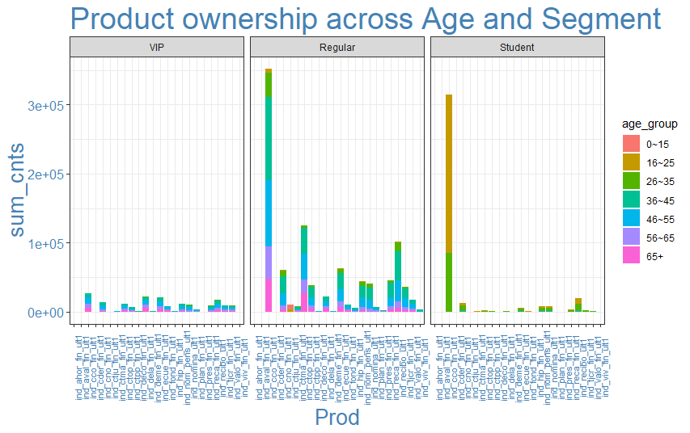
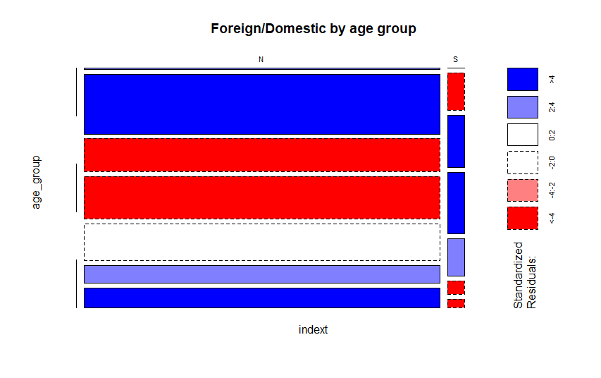

# Santander Product Recommendation


### Part 1 - Project Goals
---------------------------------------
To support needs for a range of financial decisions, Santander Bank offers a lending hand to their customers through personalized product recommendations. Under their current system, a small number of Santander’s customers receive many recommendations while many others rarely see any, resulting in poor customer experience.

The project aims to assist the bank to predict which products their existing customers will use in the next month based on their past behaviors and product ownerships. The goal of this project is to take Santander Bank customer information between January 2015 and May 2016, understand client behaviours and to design a solution to predict which financial service products they are likely to purchase in the next month. With a more effective recommendation system in place, Santander can better meet their client’s needs, provide better client experience with more personalised product recommendations.

Data used in this project is available on [Kaggle](https://www.kaggle.com/c/santander-product-recommendation/data). This project mainly uses train dataset, which includes 13 millions rows of customer bahaviour data, split by month.


### Part 2 - Deep Dive into Data
---------------------------------------
The dataset contains 48 variables and around 13.6 million rows of data observations. I find this dataset too large for my PC to process, and therefore decide to take a random sample of 1 million rows and use it for all further exercises. Given that financial service industry is subject to seasonal trend (Christmas bonus, tax season, etc.) and the goal is to predict the purchasing behaviour for June, I decide to take 80% of the data from May - Jun 2015 and May 2016, and 20% from the rest months.

#### Available Variables

1. Categorical variables:

| Variable               	|  Defination                                             	|
|------------------------	|---------------------------------------------------------	|
| sexo                   	|  gender                                                 	|
| ind_nuevo              	|  new customer index                                     	|
| ind_empleado           	|  customer employee status                               	|
| segmento               	|  segmentation                                           	|
| nomprov                	|  Province                                               	|
| tipodom                	|  Address                                                	|
| cod_prov               	|  Province code                                          	|
| indext                 	|  Foreigner index                                        	|
| indresi                	|  Residence index                                        	|
| indrel                 	|  primary customer at beginning but   not end of month   	|
| tiprel_1mes            	|  Customer relation type at the   beginning of the month 	|
| ind_actividad_cliente  	|  customer active index                                  	|
| canal_entrada          	|  Acquisition channel                                    	|
| conyuemp               	|  Spourse index                                          	|
| fecha_dato             	|  The table is partitioned for this column                	|
| fecha_alta             	|  when they became first holder of a contract in the bank 	|


2. Numeric variables:

| Variables                                                                   	|  Defination          	|
|-----------------------------------------------------------------------------	|----------------------	|
| age                                                                         	|  age                 	|
| antiguedad                                                                  	|  seniority in months 	|
| renta                                                                       	|  gross income        	|

3. Target Variables: 

| Variable           	|  Defination              	|
|--------------------	|--------------------------	|
| ind_ahor_fin_ult1  	|  Saving Account          	|
| ind_aval_fin_ult1  	|  Guarantees              	|
| ind_cco_fin_ult1   	|  Current Accounts        	|
| ind_cder_fin_ult1  	|  Derivada Account        	|
| ind_cno_fin_ult1   	|  Payroll Account         	|
| ind_ctju_fin_ult1  	|  Junior Account          	|
| ind_ctma_fin_ult1  	|  Más particular Account  	|
| ind_ctop_fin_ult1  	|  particular Account      	|
| ind_ctpp_fin_ult1  	|  particular Plus Account 	|
| ind_deco_fin_ult1  	|  Short - term deposits   	|
| ind_deme_fin_ult1  	|  Medium - term deposits  	|
| ind_dela_fin_ult1  	|  Long - term deposits    	|
| ind_ecue_fin_ult1  	|  e - account             	|
| ind_fond_fin_ult1  	|  Funds                   	|
| ind_hip_fin_ult1   	|  Mortgage                	|
| ind_plan_fin_ult1  	|  Pensions                	|
| ind_pres_fin_ult1  	|  Loans                   	|
| ind_reca_fin_ult1  	|  Taxes                   	|
| ind_tjcr_fin_ult1  	|  Credit Card             	|
| ind_valo_fin_ult1  	|  Securities              	|
| ind_viv_fin_ult1   	|  Home Account            	|
| ind_nomina_ult1    	|  Payroll                 	|
| ind_nom_pens_ult1  	|  Pensions                	|
| ind_recibo_ult1    	|  Direct Debit            	|

#### Data Cleaning

Multiple data cleaning steps have to be conducted to the original dataset before I can perfrom any analysis and extract any valuable insights from it. 

Several variables contain missing values. Some of them can be simply imputed with more frequent status or median value, while others are more complicated. For example, I find out `renta` (gross income) has abundance of missing values and varies greatly across different province, therefore instead of filling in missing values with mean or median, it’s more accurate to break it down by province and use the median of each province.


`antiguedad` contains customer senoirty in months. I suspect data in this feature is inaccurate since there is a large amount of negative values in the dataset.
```r
    Min.   1st Qu.    Median      Mean   3rd Qu.      Max.      NA's 
-999999.0      23.0      52.0      75.6     137.0     256.0      2407 
```
Most client has a client-joined-date so I am able to recalulate the seniority for each client, using `fecha_alta`.


`Indrel` indicates whether clients are still primary customers (1), or no longer primary customers at end of month (99). It seems to be an interesting variable, as customers who are no longer primary at end of month are likely to have different purchasing behaviours than the others. Choose to replace the missing values with the more frequent status, which is "1" in this case.


To enhance visulisation readability, some new features are derived from existing variables. For example, `age_group` is created to categorise age into groups. 

Additionaly, there’s also abundance of character variables that contain empty values and inconsistent formats.I decide to clean the format and either fill the empty strings with the most common value or remove the variable, based on my judgement. Since the dataset is in Spanish, some factor levels are also translated into English for better readability.

Lastly, some features are not loaded into R in the appropriate format. For example, `fecha_dato` (current date) and `fecha_alta` (client start date) are read as factor variables, so I have to convert them into dates.

#### Data Limitation

The biggest 

### Part 3 - Initial Findings
---------------------------------------
* Product Ownership vs Age & Segment
I want to start with checking the distribution of `age`.

Looks like the distribution is very right skewed - Santander has an abundance of student aged clients, and a great number of clients in their 40's and 50's. 


* Foreigner 



